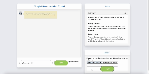

# calendar-assistant-client

Step to run the project:
1. Make sure the server (calendar-assistant) is running;
2. Run the command `npm install` to install the dependencies;
3. `pip install -r requirements.txt` to install the python dependencies;
4. `cd python-flask-backend` and run `python app.py` to start the python server;
5. create a `.env` file, get your `Custom_Search_Engine_ID` and `Custom_Search_API_Key` from [Google Custom Search](https://developers.google.com/custom-search/v1/overview), or from the repo codespace secrets and put them in there.
5. open the index.html

Demo:
